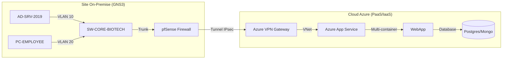

# 🏢 Smart Office 2.0 - Solution d'Infrastructure Hybride

[](https://azure.microsoft.com/)
[](https://www.docker.com/)
[](https://github.com/features/actions)

Bienvenue sur le dépôt central de la solution **Smart Office 2.0**. Ce projet propose une infrastructure hybride complète pour une entreprise de biotechnologie, intégrant un environnement On-Premise (GNS3), un tunnel sécurisé (VPN IPsec) et une plateforme d'application Cloud (Azure).

---

## 👥 L'Équipe Projet

| Membre | Rôle | Expertise Clé |
|--------|------|---------------|
| **Mehdi** | **Lead DevOps & Data** | Architecture Multi-container, CI/CD, Optimisation SQL/NoSQL |
| **Ilyes** | **Lead Infrastructure** | Firewalling, Switching Cisco, Routage Inter-VLAN |
| **Océane** | **Lead Systèmes** | Windows Server 2019, Active Directory, Azure AD Sync |
| **Florian** | **Lead Supervision** | Monitoring Zabbix, Dashboards Grafana |

---

## 🏗️ Architecture de la Solution

L'infrastructure repose sur un pont hybride entre un site local et le cloud public Azure :



---

## 🖧 Brique 1 : Infrastructure Réseau (On-Premise)

### 1. Plan d'Adressage & VLANs
L'adressage est segmenté pour garantir une isolation maximale :

| VLAN | Nom | Réseau | Usage |
|------|-----|--------|-------|
| **10** | SERVERS | `10.10.10.0/24` | Contrôleurs de domaine, SQL local |
| **20** | EMPLOYEES | `10.10.20.0/23` | Postes de travail utilisateurs |
| **30** | R&D_ZONE | `10.10.30.0/24` | Labos de recherche (Isolé) |
| **100** | MGMT | `10.10.100.0/24` | Administration des équipements |

### 2. Sécurité (Firewalling Matrix)
Le pare-feu **pfSense** gère les flux inter-VLAN avec une politique *Deny All* par défaut :
- **VLAN 30 ⮕ AD (10.10.10.10)** : Ports `445` (SMB) et `1433` (SQL) uniquement.
- **Isolation** : Aucun trafic autorisé entre VLAN 30 (R&D) et VLAN 20 (Employees).

---

## 🔒 Brique 2 : Hybridation & Connectivité

La connectivité entre le site local et Azure est assurée par un **Tunnel VPN Site-to-Site (IPsec IKEv2)** :
- **Phase 1** : AES-256, SHA256, DH Group 14.
- **Réseau Local** : `10.10.0.0/16`
- **Réseau Azure** : `10.100.0.0/16`
- **Résilience** : Reconnexion automatique et surveillance du tunnel via pfSense.

---

## 🐳 Brique 3 : DevOps & Cloud App Service

### 1. Architecture Multi-container
L'application de réservation est conteneurisée et déployée sur **Azure App Service** :
- **Frontend/API** : Node.js (Express).
- **Database Relationnelle** : PostgreSQL (Persistance des réservations).
- **Database NoSQL** : MongoDB (Logs IoT en temps réel).

### 2. Pipeline CI/CD (GitHub Actions)
Chaque commit déclenche une chaîne de déploiement automatique :
1. **Linting & Tests** : Validation du code.
2. **Docker Build** : Création de l'image de production.
3. **Push ACR** : Stockage sécurisé sur Azure Container Registry.
4. **Deploy Azure** : Mise à jour à chaud de l'App Service via Docker Compose.

### 3. Optimisations de Résilience (High Availability)
- **Connection Pooling** : Usage de `pg.Pool` pour éviter les timeouts SQL.
- **Recursive Retry Logic** : L'app attend que les bases de données soient up avant de servir les requêtes.
- **Port Tuning** : Utilisation de `WEBSITES_PORT=3000` pour un routage Azure optimal.

---

## 📊 Brique 4 : Supervision & Monitoring

La solution est supervisée 24h/24 pour garantir la disponibilité :
- **Zabbix** : Monitoring des ressources (CPU, RAM, Disque) et du statut des tunnels VPN.
- **Grafana** : Dashboards visuels pour les KPIs métier (nombre de réservations/heure, alertes IoT).

---

## 📂 Structure du Dépôt

```bash
.
├── .github/workflows/   # Automatisations CI/CD
├── app-reservation/     # Code source de l'application Web
├── infrastructure/
│   ├── cloud/           # Définitions Azure (JSON/Compose)
│   ├── reseau/          # Configs Switchs & Firewall
│   └── systeme/         # Scripts PowerShell & GPO
├── docs/                # Documentation complète & DAT
└── monitoring/          # Templates Zabbix & Grafana
```

---

## 🛠️ Instructions pour les Collaborateurs

### Installation Locale (Test)
```powershell
git clone https://github.com/supermedmed-hash/B3_MFA_ILYES_OCEANE.git
cd app-reservation
docker-compose up -d
```

### Accès Azure (Production)
URL : `https://smartoffice-poc-app.azurewebsites.net`  
*Note : Seuls les membres de l'équipe peuvent accéder aux logs via le CLI Azure.*

---
*Dépôt officiel du Projet Fil Rouge B3 - Biotech Corp - 2024/2025*