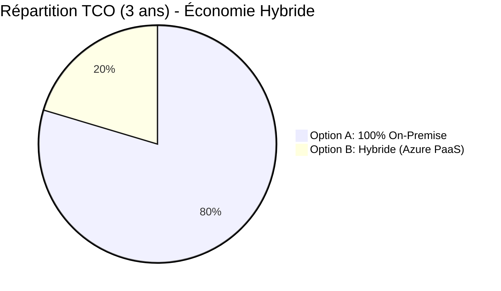

# ☁️ Analyse Comparative Cloud et TCO — Smart Office 2.0
**Auteur :** Océane (Lead Système & Cloud) | **Statut :** Validé
**Contexte :** Justification du choix du Cloud Provider pour l'hébergement de l'application Web (App Service) et le Registre de Conteneurs (ACR) dans le cadre de l'architecture hybride de Biotech Corp.

---

## 1. Analyse Comparative (Azure vs AWS vs GCP)

Pour répondre au besoin d'héberger une application Node.js conteneurisée avec un VPN Site-à-Site vers notre infrastructure locale (GNS3), nous avons évalué les trois principaux fournisseurs de cloud public.

| Critère | 🟦 Microsoft Azure | 🟧 Amazon Web Services (AWS) | 🟩 Google Cloud (GCP) |
|:---|:---|:---|:---|
| **PaaS Conteneur** | **Azure App Service** (Web App for Containers) | **Elastic Beanstalk** / ECS Fargate | **Cloud Run** |
| Facilité de déploiement | ⭐⭐⭐⭐⭐ (Intégration native Docker Compose) | ⭐⭐⭐ (Nécessite configuration ECS/Task Definitions) | ⭐⭐⭐⭐ (Très orienté Serverless/Knative) |
| **Registre d'images** | Azure Container Registry (ACR) | Elastic Container Registry (ECR) | Artifact Registry |
| **VPN Site-to-Site** | Azure VPN Gateway | AWS Site-to-Site VPN | Cloud VPN |
| Intégration AD / Identité | **Excellente** (Entra ID natif) | Bonne (AWS Directory Service) | Moyenne (Cloud Identity) |
| **Courbe d'apprentissage** | Rapide (Documentation claire, Portail intuitif) | Lente (Interface complexe, concepts très spécifiques) | Moyenne |

### 🏆 Justification du Choix : Microsoft Azure
**Pourquoi Azure a été retenu pour le projet Smart Office 2.0 :**
1. **PaaS App Service pour Docker Compose :** Azure propose la fonctionnalité `Web App for Containers` qui supporte nativement un fichier `docker-compose.yml`. Cela correspond parfaitement à notre architecture applicative sans avoir à basculer vers Kubernetes (trop lourd pour ce PoC).
2. **Écosystème Microsoft :** Notre infrastructure réseau On-Premise reposant sur Windows Server 2019 (AD DS), Azure offre le meilleur potentiel d'évolution (migration future vers Entra ID hybride).
3. **Simplicité du VPN :** Azure VPN Gateway s'intègre très facilement avec pfSense en IKEv2.

---

## 2. Analyse TCO (Total Cost of Ownership) sur 3 ans

L'objectif de cette section est de comparer le coût de maintien d'une architecture locale (On-Premise) versus l'architecture Hybride actuelle (Serveurs locaux + App Web sur Azure).

### Hypothèse de Dimensionnement (Biotech Corp)
*   Besoin de haute disponibilité pour l'application Web (accessible 24/7 de l'extérieur).
*   Besoin de sécurité et souveraineté pour les bases de données (restent en local).

### 2.1 Option A : 100% On-Premise (Garder l'App Web en local)
Nécessite l'achat de serveurs supplémentaires, de licences, et d'un routeur/firewall capable de gérer une forte charge externe (DMZ exposée).

| Poste de dépense | Coût Année 1 (CAPEX + OPEX) | Coût Année 2 & 3 (OPEX) | Total sur 3 ans |
|:---|:---|:---|:---|
| Matériel (2x Serveurs Dell PowerEdge - Redondance) | 12 000 € (CAPEX) | 0 € | 12 000 € |
| Licences (VMware/Hyper-V, Windows, Firewall avancé) | 3 500 € | 3 500 € / an | 10 500 € |
| Énergie & Refroidissement supplémentaire | 1 800 € | 1 800 € / an | 5 400 € |
| Bande passante Fibre (Garantie GTR 4h) | 3 600 € | 3 600 € / an | 10 800 € |
| Temps Homme (MCO : Maintien en Condition Opérat.) | 10 000 € | 10 000 € / an | 30 000 € |
| **TOTAL OPTION A** | **30 900 €** | **18 900 € / an** | **68 700 €** |

### 2.2 Option B : Architecture Hybride (Choix du projet)
Les bases de données restent sur l'infrastructure locale existante. Seule l'application Web et le VPN sont hébergés sur Azure (PaaS). L'investissement matériel initial est très faible.

| Poste de dépense (Azure Pay-As-You-Go) | Coût Mensuel Estimé | Coût Annuel (OPEX) | Total sur 3 ans |
|:---|:---|:---|:---|
| **App Service Plan** (Linux B1 - Basic, scale manual) | ~12 € / mois | 144 € | 432 € |
| **Container Registry** (Basic, 10GB storage) | ~5 € / mois | 60 € | 180 € |
| **VPN Gateway** (VpnGw1 - 650 Mbps) | ~130 € / mois | 1 560 € | 4 680 € |
| **Bande Passante Sortante** (Egress ~100GB/mo) | ~8 € / mois | 96 € | 288 € |
| Temps Homme (Gestion Cloud, CI/CD automatisé) | (Inclus, réduit grâce au PaaS) | 4 000 € / an | 12 000 € |
| **TOTAL OPTION B (Cloud Part)** | **~155 € / mois** | **5 860 € / an** | **17 580 €** |

*Note : Les serveurs locaux pour l'AD et les BDD (Option B) utilisent l'infrastructure matérielle déjà amortie de l'entreprise. Le TCO met en évidence le coût de la brique "Web/Application".*

### 2.3 Bilan de l'analyse TCO

**Conclusion de l'analyse financière :**
L'adoption de l'architecture Hybride pour l'application Smart Office 2.0 permet une économie estimée à **74% sur 3 ans** (soit environ 51 000 € économisés) par rapport à un hébergement 100% On-Premise. 
Les gains s'expliquent par :
1.  **L'élimination du CAPEX** (pas de serveurs Web frontaux à acheter).
2.  **La réduction du MCO** grâce aux services managés (PaaS), Azure gérant la maintenance de l'OS sous-jacent et du moteur Docker.
3.  **L'agilité** : La facturation au mois permet d'arrêter les environnements de test lorsqu'ils ne sont pas utilisés.
