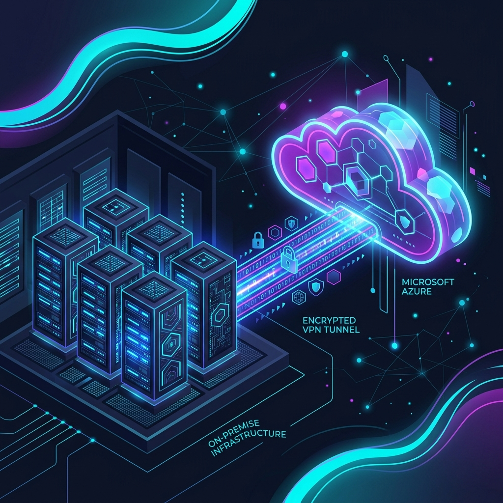
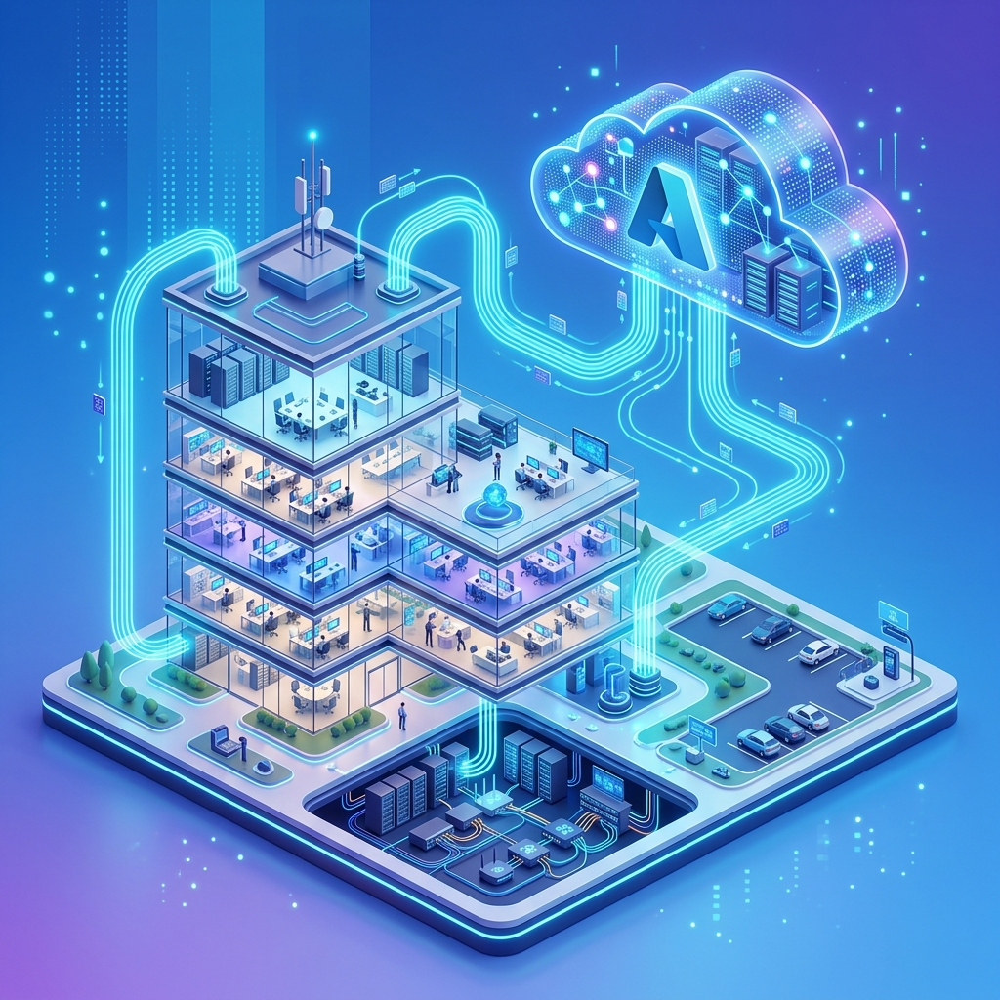
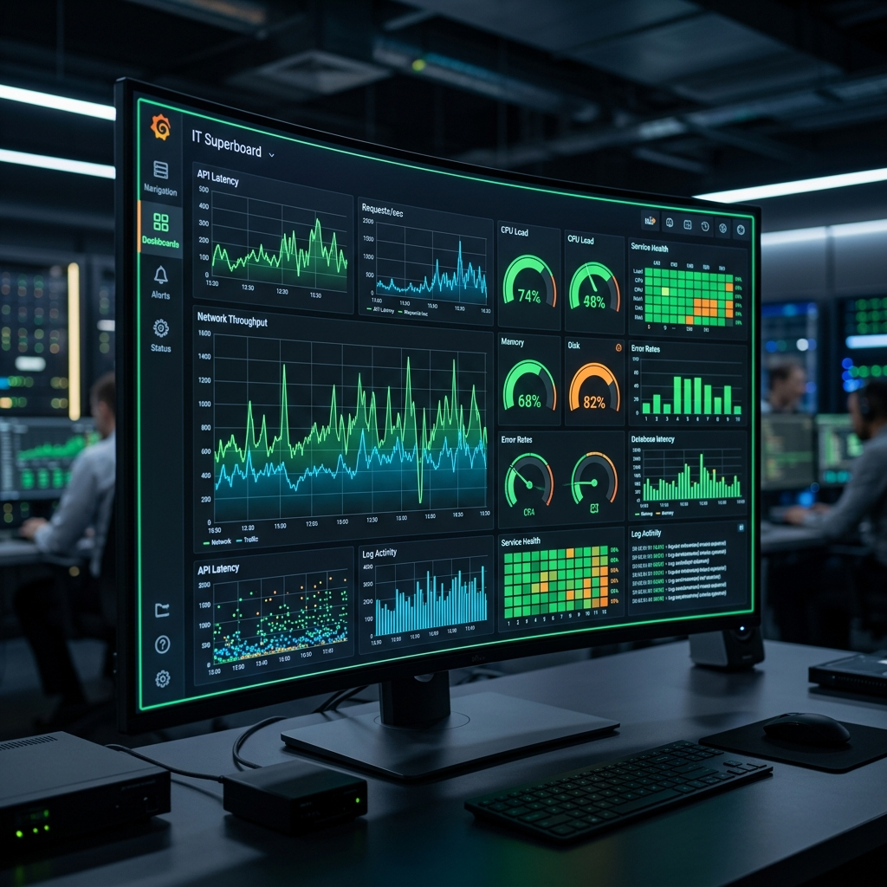

# 🎓 Soutenance Orale B3 - Smart Office 2.0 (Script & PowerPoint)

Ce document contient la structure de votre présentation PowerPoint (axée sur les visuels) et le script détaillé pour les 4 intervenants, calibré pour **25 minutes d'oral**.

*Rôles :*
- 👩‍💻 **Océane** : Lead Système & Cloud (~6 min)
- 🔒 **Ilyes** : Lead Réseau & Sécurité (~6 min)
- 🚀 **Mehdi** : Lead DevOps & BDD (~6 min)
- 📊 **Florian** : Lead Supervision & Data (~6 min)
- ⏱️ **Conclusion/Démo** : Commune (~1 min)

---

## 🎨 Slide 1 : Titre & Introduction
**Visuel à produire** : Un titre épuré, logo "Biotech Corp" / "Smart Office 2.0", et les prénoms de l'équipe B3. Design minimaliste, fond sombre.

> **🗣️ Océane (00:00 - 01:00)**
> "Bonjour à tous et merci de nous recevoir. Nous sommes l'équipe en charge de la transformation numérique de Biotech Corp. Aujourd'hui, nous allons vous présenter le socle technologique du projet 'Smart Office 2.0'. L'entreprise passant de 50 à 200 collaborateurs avec une forte culture du télétravail, notre mission a été de concevoir une infrastructure à la fois scalable, hyper-sécurisée et résiliente. Nous allons vous démontrer comment nous avons répondu à ce cahier des charges exigeant."

---

## 🎨 Slide 2 : Le Choix Stratégique - L'Architecture Hybride
**Visuel à afficher** : 

*(Un visuel contrasté montrant le On-Premise d'un côté, Azure de l'autre, reliés par un tunnel chiffré brillant).*

> **🗣️ Océane (01:00 - 06:00)**
> "Face à l'hyper-croissance de Biotech Corp, le 100% local n'était plus viable financièrement, et le 100% Cloud posait des problèmes de souveraineté des données de R&D. Nous avons donc opté pour une approche **Hybride**. 
> Comme vous le voyez sur ce schéma conceptuel, nous conservons nos serveurs critiques (Active Directory, Bases de données) 'On-Premise' pour la sécurité. En revanche, l'application métier Web est déportée sur le Cloud Microsoft Azure via le service PaaS 'App Service'. 
> Notre analyse TCO (Total Cost of Ownership) sur 3 ans le prouve : cette hybridation nous fait économiser près de 74% des coûts par rapport à l'achat de nouveaux serveurs locaux, tout en bénéficiant de la haute disponibilité d'Azure. Pour lier ces deux mondes, je laisse la parole à Ilyes."

---

## 🎨 Slide 3 : Architecture Réseau & Connectivité
**Visuel à afficher** : Le Schéma logique du réseau (Matrice des flux) ou le plan d'adressage mis en valeur avec de belles icônes Cisco/pfSense.

> **🗣️ Ilyes (06:00 - 09:00)**
> "Merci Océane. Le cœur de notre hybridation repose sur un tunnel VPN IPsec IKEv2 monté entre notre pare-feu local pfSense et la passerelle Azure. C'est ce tunnel qui permet à l'application Cloud de requêter nos bases locales de manière totalement transparente et sécurisée.
> Côté LAN, nous avons structuré le réseau en VLANs stricts : le VLAN 20 pour les employés, et un VLAN 30 ultra-isolé pour la R&D. Le réseau Wi-Fi d'entreprise s'appuie sur des points d'accès contrôlés, avec une authentification 802.1X reliée à l'Active Directory. Chaque connexion est tracée, aucun mot de passe partagé n'est utilisé pour le réseau principal."

---

## 🎨 Slide 4 : Sécurité & Zero Trust
**Visuel à afficher** : Un bouclier design protégeant les différents réseaux, avec la mention "Never Trust, Always Verify".

> **🗣️ Ilyes (09:00 - 12:00)**
> "Notre politique de sécurité est dictée par le modèle **Zero Trust**. Le pare-feu pfSense agit en 'Default Deny'. Par exemple, le réseau des employés ne peut techniquement pas atteindre le réseau de la R&D. 
> De plus, face aux risques de cyberattaques et aux exigences du télétravail, nous avons implémenté des accès distants sécurisés via OpenVPN pour nos collaborateurs, avec une authentification forte. La surface d'attaque est réduite au strict minimum."

---

## 🎨 Slide 5 : L'Usine Logicielle (DevOps) & Données
**Visuel à afficher** : 

*(Un pipeline infini CI/CD (logo GitHub -> Docker -> Azure) flottant au dessus d'un bâtiment moderne).*

> **🗣️ Mehdi (12:00 - 15:30)**
> "Pour soutenir cette infrastructure moderne, nous avons adopté une démarche DevOps complète. Notre application métier est conteneurisée avec Docker. Cela garantit une portabilité parfaite.
> Le déploiement est entièrement automatisé via des pipelines CI/CD sur GitHub Actions. À chaque commit, une nouvelle image est générée, poussée dans notre registre Azure (ACR), et déployée en 'Zero Downtime' sur l'App Service Azure. L'erreur humaine lors des mises en production est quasiment éliminée."

---

## 🎨 Slide 6 : Stratégie Data & Sauvegarde
**Visuel à afficher** : Schéma d'une base de données SQL et NoSQL (PostgreSQL / MongoDB) avec une illustration de la règle de backup "3-2-1".

> **🗣️ Mehdi (15:30 - 18:00)**
> "Côté données, nous utilisons une approche polyglotte : PostgreSQL pour garantir l'intégrité de nos réservations, et MongoDB pour absorber le flux massif de logs de nos capteurs IoT.
> Pour protéger ces données vitales, nous appliquons la règle de sauvegarde du 3-2-1 : 3 copies des données, sur 2 supports différents (NAS Synology en RAID et disques SSD locaux), dont 1 copie externalisée et immuable sur un stockage Cloud (Azure Blob Storage). Nos scripts PowerShell automatisent l'ensemble de ces dumps chaque nuit."

---

## 🎨 Slide 7 : Supervision & Observabilité (Le Cockpit)
**Visuel à afficher** : 

*(Une interface sombre de monitoring très visuelle avec des graphiques en temps réel).*

> **🗣️ Florian (18:00 - 21:00)**
> "Bien sûr, une telle infrastructure nécessite un monitoring proactif. Nous avons déployé une stack de supervision double : **Zabbix** pour l'IT, et **Grafana** pour le management et la data.
> Comme vous le voyez sur cette maquette, Zabbix scrute l'état du tunnel VPN, l'espace disque de l'AD, et la charge de nos VM via SNMP et agents. Si le tunnel VPN IPsec tombe ou si le CPU sature, des alertes sont remontées automatiquement sur nos canaux Slack dédiés. Grafana, quant à lui, est directement pluggé sur notre base MongoDB pour afficher en temps réel l'utilisation des locaux connectés."

---

## 🎨 Slide 8 : Résilience et ITSM
**Visuel à afficher** : Schéma temporel d'un incident (RTO/RPO), avec un logo ITSM/ITIL.

> **🗣️ Florian (21:00 - 24:00)**
> "Enfin, la technique ne suffit pas sans processus. Nous avons structuré la gestion des incidents (ITSM) et réalisé une Analyse d'Impact sur l'Activité (BIA). 
> Ce BIA a conduit à notre Plan de Reprise d'Activité (PRA). Par exemple, en cas de sinistre majeur sur notre baie serveur principale On-Premise, notre objectif de délai de reprise (RTO) est fixé à 4 heures, temps nécessaire pour remonter les VMs depuis les sauvegardes NAS ou Cloud. L'application Azure, elle, restera en ligne."

---

## 🎨 Slide 9 : Bilan & Démonstration
**Visuel à afficher** : Architecture globale finale, avec le mot "Démonstration" ou "Questions".

> **🗣️ Équipe (Florian ou Océane) (24:00 - 25:00)**
> "Pour conclure, le projet Smart Office 2.0 répond à tous les enjeux de Biotech Corp : une base locale souveraine et sécurisée, propulsée par la flexibilité du Cloud pour absorber la croissance. Nous avons respecté le budget, sécurisé les accès via du Zero Trust, et automatisé les tâches chronophages avec du CI/CD.
> Nous vous remercions pour votre attention et sommes maintenant à votre disposition pour la démonstration ou répondre à vos questions."

---

### 💡 Conseils pour le PowerPoint :
- **Règle du 6x6** : Pas plus de 6 puces par slide, pas plus de 6 mots par puce. Vos slides ne doivent pas être un prompteur, mais un support visuel à votre discours.
- Utilisez un thème sombre (Dark Mode) pour faire ressortir les couleurs "Cloud" (Bleu cyan, violet), ça donne un côté très tech et premium.
- Intégrez les 3 images IA que j'ai générées dans les slides 2, 5 et 7 pour apporter un véritable effet "Wahou" au jury.
- Ne lisez pas vos notes, regardez le jury. Le script ci-dessus est fait pour être assimilé et reformulé avec vos propres mots.
