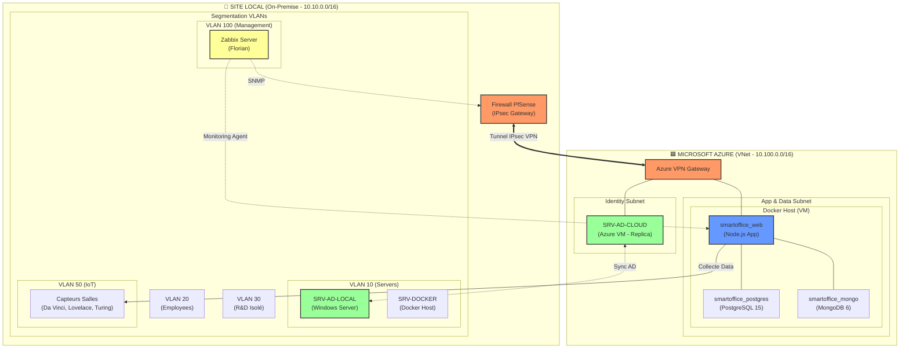

# 🌐 Architecture Hybride Réelle - Smart Office 2.0 (Mermaid Edition)

Ce document fournit la version Mermaid du schéma d'architecture finale, synchronisée avec l'implémentation de la branche `develop`.

## 📊 Diagramme Mermaid Détaillé

## 📝 Guide de Lecture
*   **Conteneurisation** : Les services Web, Postgres et Mongo sont regroupés dans une seule VM Docker sur Azure pour le PoC.
*   **Hybridation** : Le tunnel VPN permet la synchronisation des annuaires Active Directory entre le site local et Azure.
*   **Supervision** : Florian gère Zabbix depuis le VLAN 20 local pour monitorer l'ensemble de l'infrastructure.
