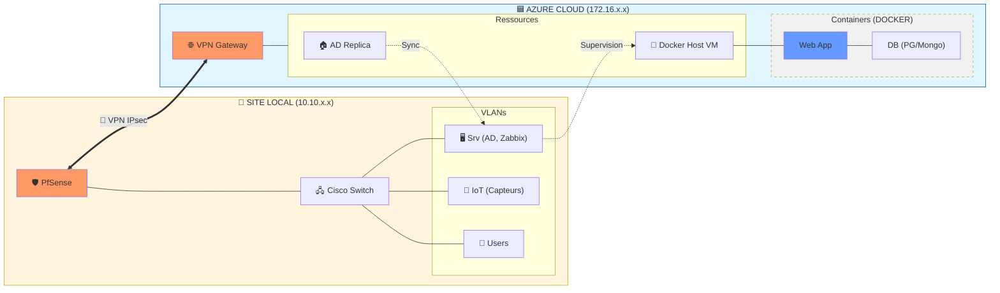

# 📊 Architecture Hybride - Version Lisible (LR)

Cette version utilise une orientation horizontale pour une meilleure clarté des flux entre le site local et Azure.

```mermaid
graph LR
    %% SITE LOCAL
    subgraph LOCAL ["🏢 SITE LOCAL (10.10.x.x)"]
        direction TB
        PFS["🛡️ PfSense"]
        SW["🖧 Cisco Switch"]
        
        subgraph VLANS ["VLANs"]
            V20["🖥️ Srv (AD, Zabbix)"]
            V40["📡 IoT (Capteurs)"]
            V30["👥 Users"]
        end
        
        PFS --- SW
        SW --- V20
        SW --- V40
        SW --- V30
    end

    %% TUNNEL
    PFS <== "🔗 VPN IPsec" ==> VGW

    %% AZURE CLOUD
    subgraph AZURE ["🟦 AZURE CLOUD (172.16.x.x)"]
        direction TB
        VGW["🌐 VPN Gateway"]
        
        subgraph COMPUTE ["Ressources"]
            direction LR
            DC_AZ["🏠 AD Replica"]
            DOCKER["🐳 Docker Host VM"]
        end
        
        subgraph CONTAINERS ["Containers (DOCKER)"]
            WEB["Web App"]
            DB["DB (PG/Mongo)"]
        end
        
        VGW --- COMPUTE
        DOCKER --- WEB
        WEB --- DB
    end

    %% FLUX TRANSVERSES
    V20 -. "Supervision" .-> DOCKER
    DC_AZ -. "Sync" .-> V20

    %% STYLING
    style LOCAL fill:#fff4dd,stroke:#d4a017
    style AZURE fill:#e1f5fe,stroke:#01579b
    style PFS fill:#f96
    style VGW fill:#f96
    style WEB fill:#69f
    style CONTAINERS fill:#f0f0f0,stroke-dasharray: 5 5
```
