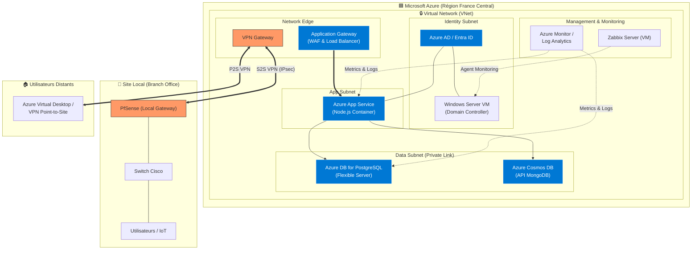

# ☁️ Schéma d'Infrastructure Cloud-First - Smart Office 2.0

Ce document présente l'architecture modernisée du projet, où le Système d'Information (SI) est centralisé sur **Microsoft Azure**, offrant scalabilité, haute disponibilité et sécurité native.

## 📊 Diagramme d'Architecture Cloud

## 🔍 Migration vers le SI Cloud

### 1. Couche Applicative (PaaS)
*   **Azure App Service** : L'application Node.js ne tourne plus sur un serveur local mais sur un service managé (PaaS). Cela permet l'auto-scaling et simplifie les mises à jour via GitHub Actions.
*   **Application Gateway (WAF)** : Protection contre les attaques web (OWASP Top 10) et répartition de charge.

### 2. Services de Données (Managed DB)
*   **PostgreSQL Flexible Server** : Base relationnelle managée avec sauvegardes automatiques et haute disponibilité.
*   **Cosmos DB (Mongo API)** : Stockage des logs IoT avec une latence ultra-faible et une distribution mondiale si nécessaire.

### 3. Identité et Sécurité
*   **Azure AD (Entra ID)** : Devient la source de vérité principale pour l'authentification.
*   **Identity Isolation** : Le contrôleur de domaine (VM) est sécurisé dans un subnet dédié pour les besoins legacy de l'AD classique.

### 4. Connectivité Hybride
*   **VPN Gateway** : Assure la liaison entre les ressources Cloud et les terminaux IoT ou utilisateurs restés sur le site physique (VLANs locaux via PfSense).

### 5. Supervision Native
*   **Azure Monitor** : Centralise tous les logs de la plateforme Azure pour une visibilité 360°.
