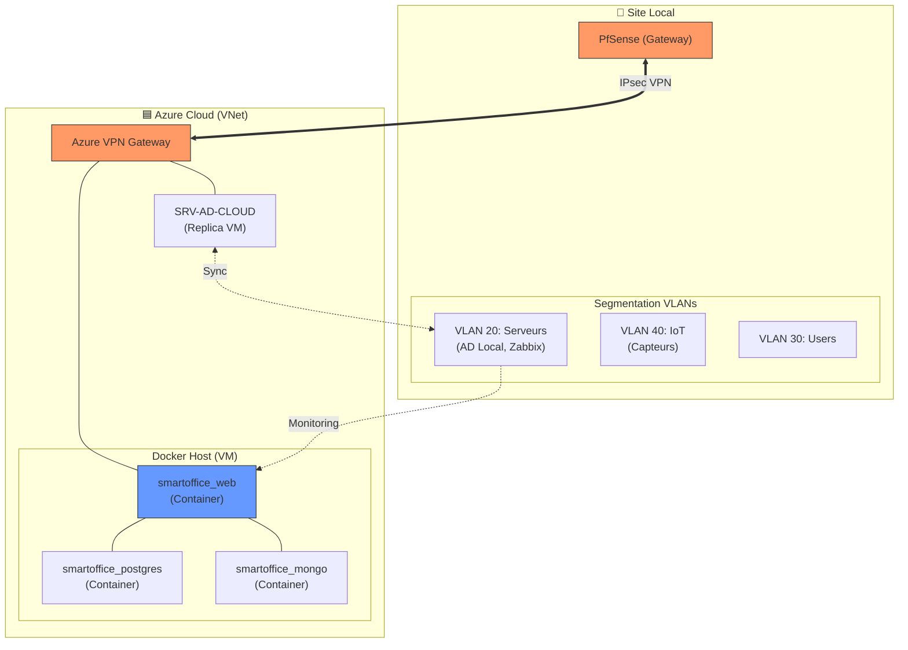

# 🌐 Architecture Hybride Réelle - Smart Office 2.0

Ce document décrit l'architecture technique telle qu'elle est implémentée dans le dépôt, basée sur une hybridation entre le site local et une infrastructure IaaS/PaaS sur Azure.

## 📊 Schéma d'Architecture (Implémentation Réelle)

## 🔍 Détails de l'implémentation (Branche Develop)

### 1. Couche DevOps (Mehdi)
*   **Orchestration** : Utilisation de Docker Compose pour gérer la pile applicative sur un hôte Docker (VM Azure).
*   **Conteneurs** : 
    *   `smartoffice_web` : Application Node.js.
    *   `smartoffice_postgres` : Données structurées (PostgreSQL 15).
    *   `smartoffice_mongo` : Logs IoT (MongoDB 6).

### 2. Couche Réseau (Ilyes)
*   **Segmentation** : 4 VLANs distincts sur le site local pour isoler le trafic IoT et serveurs.
*   **Sécurité** : Firewall PfSense gérant le tunnel IPsec vers Azure.

### 3. Couche Système & Cloud (Océane)
*   **Hybridation AD** : Windows Server 2019 local et replica VM sur Azure pour assurer la continuité de service.

### 4. Couche Data & Supervision (Florian)
*   **Supervision** : Serveur Zabbix local monitorant les instances cloud et locales.
*   **Bases de données** : Maintenance et optimisation des instances PostgreSQL et MongoDB.
