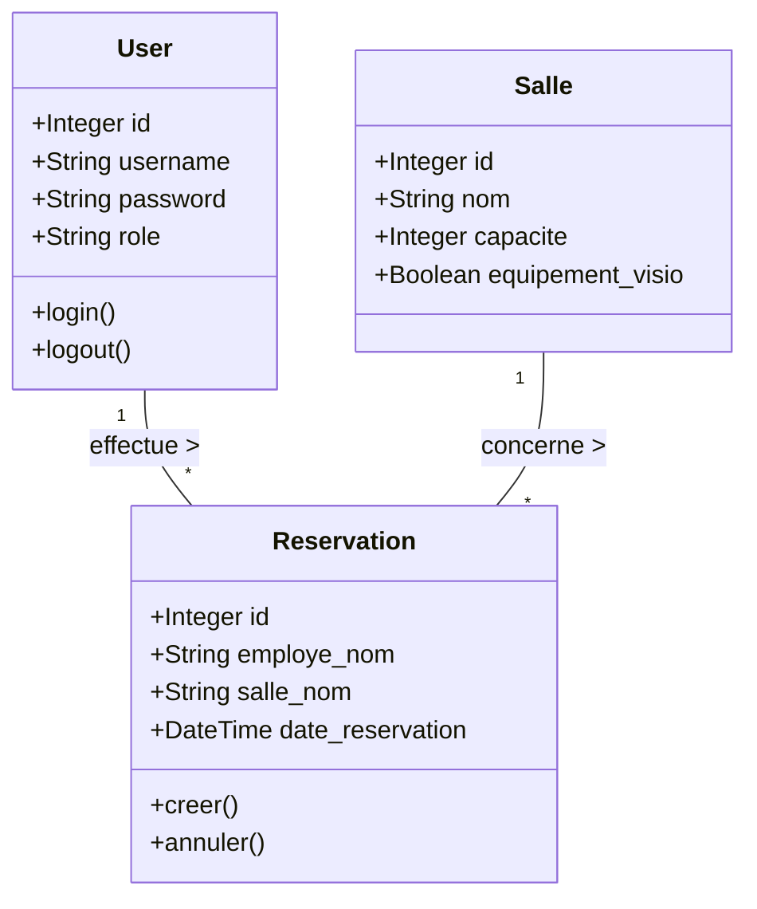
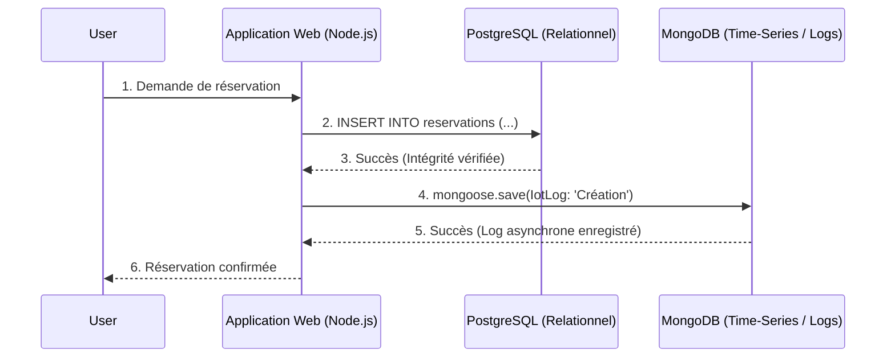

# 📊 Modèles de Données UML/Merise — Smart Office 2.0
**Auteur :** Florian (Lead Data) | **Statut :** Validé
**Contexte :** Application de réservation de salles et de suivi de logs IoT

Afin de répondre aux exigences métiers d'intégrité (réservations) et de performance (logs temps réel), l'architecture s'appuie sur un système de base de données polyglotte :
1. **PostgreSQL** : Pour les données structurées et relationnelles (Employés, Salles, Réservations).
2. **MongoDB** : Pour les données non structurées et les flux volumineux (Logs capteurs IoT).

---

## 1. Modélisation Relationnelle (PostgreSQL)

Cette base de données garantit l'intégrité référentielle, la cohérence des réservations et la gestion stricte des rôles d'authentification.

### 1.1 Diagramme de Classes (UML)



### 1.2 Modèle Logique de Données (MLD)

*   **users** (<u>id</u>: SERIAL, username: VARCHAR(50) UNIQUE, password: VARCHAR(50), role: VARCHAR(20))
*   **salles** (<u>id</u>: SERIAL, nom: VARCHAR(50) UNIQUE, capacite: INT, equipement_visio: BOOLEAN) *(Note : Les salles sont actuellement codées en dur dans le PoC Node.js, mais ceci représente l'évolution cible de la DB).*
*   **reservations** (<u>id</u>: SERIAL, employe_nom: VARCHAR(100), salle_nom: VARCHAR(50), date_reservation: TIMESTAMP)
    *   *Constraint* : FOREIGN KEY (employe_nom) REFERENCES users(username)
    *   *Constraint* : FOREIGN KEY (salle_nom) REFERENCES salles(nom)

---

## 2. Modélisation NoSQL Document (MongoDB)

Cette base de données est conçue pour l'ingestion à haute fréquence (High Throughput) des capteurs IoT des salles de réunion, et conserve l'historique des actions applicatives sans impacter les performances de la base transactionnelle.

### 2.1 Structure du Document JSON (IotLogSchema)

En NoSQL, il n'y a pas de schéma strict forcé par la base de données, mais l'application impose la structure `Mongoose` suivante :

```json
{
  "_id": "ObjectId('648a12b...9d')",
  "salle_nom": "String (ex: 'Salle Da Vinci')",
  "action": "String (ex: 'Création', 'Suppression', 'Mouvement Détecté')",
  "utilisateur": "String (ex: 'employe', 'admin', 'capteur_iot_01')",
  "timestamp": "Date (ex: ISODate('2026-06-23T14:32:00.000Z'))",
  "__v": 0
}
```

### 2.2 Stratégie d'Indexation

Pour optimiser l'affichage sur le Dashboard (Grafana ou interface Web) et filtrer rapidement les anomalies, les index suivants sont créés (ou recommandés) dans MongoDB :

1.  **Index sur `timestamp` (DESC)** : Pour afficher rapidement les 10 derniers logs chronologiques dans le frontend Node.js.
2.  **Index Composé `[salle_nom, action]`** : Pour permettre à Zabbix ou Grafana de compter rapidement le nombre de "Créations" pour une salle spécifique sur une période donnée.

---

## 3. Flux de Données et Cohérence Polyglotte



**Justification du choix technique :**
En séparant les logs (Mongo) des transactions métier (Postgres), nous assurons que si le composant IoT s'emballe et génère 10 000 logs par seconde (attaque DDoS ou capteur défectueux), la base de données de réservation métier (Postgres) ne subit aucun ralentissement (Locks).
