# 🏢 Schéma d'Architecture Physique — Smart Office 2.0
**Auteur :** Ilyes (Lead Réseau) | **Statut :** Validé  
**Contexte :** Immeuble de 4 étages — Biotech Corp (siège social — 200 employés cible)

---

## 1. Vue Physique de l'Immeuble

```mermaid
graph TD
    subgraph "🏢 Immeuble Biotech Corp — 4 Étages"

        subgraph "Étage 4 — Direction & R&D"
            E4_AP["📶 AP Wi-Fi x2"]
            E4_SW["🔲 Switch Accès Cisco 2960 (24p)"]
            E4_PC["💻 15 Postes (VLAN 30 R&D)"]
            E4_PC2["💻 5 Postes Direction (VLAN 20)"]
        end

        subgraph "Étage 3 — Espaces Collaboratifs"
            E3_AP["📶 AP Wi-Fi x3"]
            E3_SW["🔲 Switch Accès Cisco 2960 (48p)"]
            E3_PC["💻 40 Postes (VLAN 20 Employés)"]
            E3_IOT["📡 Capteurs IoT salles (VLAN 50)"]
            E3_VOIP["📞 Téléphones IP x10 (VLAN 40)"]
        end

        subgraph "Étage 2 — Open Space"
            E2_AP["📶 AP Wi-Fi x4"]
            E2_SW["🔲 Switch Accès Cisco 2960 (48p)"]
            E2_PC["💻 80 Postes (VLAN 20 Employés)"]
            E2_VOIP["📞 Téléphones IP x20 (VLAN 40)"]
            E2_PRINT["🖨️ Imprimantes x4 (VLAN 50)"]
        end

        subgraph "Étage 1 — Accueil & Salle Serveurs"
            E1_AP["📶 AP Wi-Fi x2 (VLAN 99 Guest)"]
            E1_SW_CORE["⭐ Switch Cœur Cisco 3650 (L3)"]
            E1_SW_ACC["🔲 Switch Accès Cisco 2960 (24p)"]
            E1_PC["💻 10 Postes Accueil (VLAN 20)"]

            subgraph "🔒 Salle Serveurs (Baie 42U)"
                SRV_AD["🖥️ SRV-AD-LOCAL<br/>Windows Server 2019<br/>AD / DNS / DHCP<br/>10.10.10.10"]
                SRV_DOCKER["🐳 SRV-DOCKER<br/>Ubuntu 22.04<br/>Docker Host<br/>10.10.10.20"]
                SRV_ZABBIX["📊 SRV-ZABBIX<br/>Zabbix + Grafana<br/>10.10.100.10"]
                FW_PFS["🛡️ FIREWALL<br/>pfSense (2x NIC)<br/>WAN: DHCP FAI<br/>LAN: 10.10.10.1"]
                UPS["🔋 Onduleur APC 1500VA"]
                NAS_BKP["💾 NAS Synology<br/>Backups BDD<br/>10.10.10.30"]
            end
        end
    end

    %% Câblage vertical (Backbone fibre)
    E4_SW ---|"🔗 Fibre 10G (Trunk)"| E1_SW_CORE
    E3_SW ---|"🔗 Fibre 10G (Trunk)"| E1_SW_CORE
    E2_SW ---|"🔗 Fibre 10G (Trunk)"| E1_SW_CORE
    E1_SW_ACC ---|"🔗 Cuivre 1G"| E1_SW_CORE

    %% Connexions salle serveurs
    E1_SW_CORE ---|"Trunk"| FW_PFS
    E1_SW_CORE ---|"VLAN 10"| SRV_AD
    E1_SW_CORE ---|"VLAN 10"| SRV_DOCKER
    E1_SW_CORE ---|"VLAN 100"| SRV_ZABBIX
    E1_SW_CORE ---|"VLAN 10"| NAS_BKP

    %% Lien WAN
    FW_PFS ---|"🌐 Fibre FAI 500Mbps"| INTERNET["☁️ Internet"]
    FW_PFS -.-|"🔐 VPN IPsec"| AZURE["🟦 Azure Cloud"]

    %% Styling
    style FW_PFS fill:#e74c3c,color:#fff
    style E1_SW_CORE fill:#f39c12,color:#fff
    style AZURE fill:#0078d4,color:#fff
    style INTERNET fill:#95a5a6,color:#fff
```

---

## 2. Inventaire Matériel

### 2.1 Équipements Réseau

| Équipement | Modèle | Quantité | Localisation | Rôle |
|:---|:---|:---:|:---|:---|
| **Switch Cœur (L3)** | Cisco Catalyst 3650-48PS | 1 | Étage 1 — Baie serveurs | Routage inter-VLAN, agrégation trunk, PoE+ |
| **Switch Accès (L2)** | Cisco Catalyst 2960-X 48p | 2 | Étages 2 et 3 | Distribution des ports, 802.1Q, PoE |
| **Switch Accès (L2)** | Cisco Catalyst 2960-X 24p | 2 | Étages 1 et 4 | Distribution des ports, 802.1Q |
| **Pare-feu** | pfSense (appliance) | 1 | Étage 1 — Baie serveurs | Firewall, VPN IPsec, NAT, filtrage |
| **Bornes Wi-Fi** | Cisco Aironet / Meraki | 11 | Tous les étages | Accès WLAN, SSID par VLAN |
| **Contrôleur WLAN** | Cisco WLC 2504 | 1 | Étage 1 — Baie serveurs | Gestion centralisée des AP |

### 2.2 Serveurs

| Serveur | OS | IP | RAM | Disque | Rôle |
|:---|:---|:---|:---:|:---|:---|
| **SRV-AD-LOCAL** | Windows Server 2019 | 10.10.10.10 | 8 Go | 120 Go SSD | AD DS, DNS, DHCP, GPO |
| **SRV-DOCKER** | Ubuntu 22.04 LTS | 10.10.10.20 | 16 Go | 500 Go SSD | Docker Host (App, PostgreSQL, MongoDB) |
| **SRV-ZABBIX** | Ubuntu 22.04 LTS | 10.10.100.10 | 8 Go | 250 Go SSD | Zabbix Server, Grafana |
| **NAS-BACKUP** | Synology DS220+ | 10.10.10.30 | 2 Go | 2×4 To (RAID 1) | Sauvegarde BDD, configs pfSense |

### 2.3 Câblage

| Type | Usage | Débit | Localisation |
|:---|:---|:---:|:---|
| **Fibre OM4 (10 Gbps)** | Backbone vertical (inter-étages) | 10 Gbps | Gaines techniques |
| **Cat 6A (Cuivre)** | Distribution horizontale (postes, AP, téléphones) | 1-10 Gbps | Chaque étage — faux plancher/chemin de câble |
| **Fibre FAI** | Lien Internet | 500 Mbps | Étage 1 → NRO FAI |

---

## 3. Répartition des VLANs par Étage

| Étage | VLANs actifs | Nombre de prises |
|:---|:---|:---:|
| **Étage 1** (Accueil + Salle serveurs) | VLAN 10 (Serveurs), VLAN 20 (Employés), VLAN 99 (Guest), VLAN 100 (Mgmt) | 40 |
| **Étage 2** (Open Space) | VLAN 20 (Employés), VLAN 40 (VoIP), VLAN 50 (IoT/Imprimantes) | 120 |
| **Étage 3** (Collaboratif) | VLAN 20 (Employés), VLAN 40 (VoIP), VLAN 50 (IoT capteurs) | 60 |
| **Étage 4** (Direction + R&D) | VLAN 20 (Employés), VLAN 30 (R&D isolé) | 30 |

---

## 4. Alimentation Électrique et Redondance

| Composant | Protection | Autonomie |
|:---|:---|:---|
| Baie serveurs | Onduleur APC Smart-UPS 1500VA | ~20 min en charge complète |
| Switchs PoE | Alimentation redondante interne | N/A (PoE pour AP + téléphones) |
| Lien FAI | Backup 4G via interface OPT1 pfSense | Illimité (forfait data) |

---

*Document rédigé par Ilyes (Lead Réseau & Sécurité) — Juin 2026*
